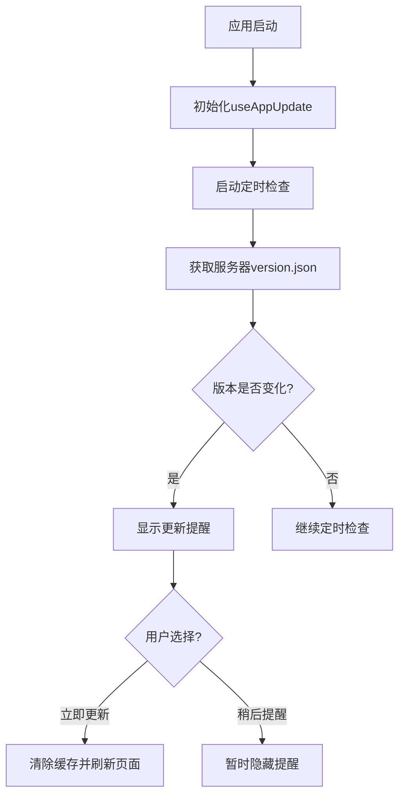

# 应用自动更新功能使用指南

## 🚀 功能概述

为React Todo应用添加了智能的自动更新检测和提示功能，当服务器部署新版本后，用户会自动收到更新提醒。

## ✨ 主要特性

### 🔍 自动检测

- **版本监控**: 每5分钟自动检查一次服务器版本
- **智能对比**: 对比版本号和构建哈希，精确检测更新
- **网络优化**: 自动处理网络状态变化和页面可见性
- **缓存控制**: 防止浏览器缓存干扰版本检测

### 💬 用户友好

- **优雅提醒**: 右上角显示精美的更新通知
- **详细信息**: 显示当前版本和最新版本对比
- **操作选择**: 提供"立即更新"和"稍后提醒"选项
- **视觉反馈**: 更新过程中显示进度和状态

### 🛠️ 开发友好

- **环境感知**: 开发环境下提供手动检查按钮
- **调试信息**: 详细的控制台日志和错误提示
- **可配置**: 灵活的配置选项和检查间隔

## 📁 文件结构

```

src/
├── hooks/
│   └── useAppUpdate.js          # 更新检测核心逻辑
├── components/
│   ├── AppUpdateNotification.jsx # 更新提示UI组件
│   └── index.js                 # 组件导出
├── styles/components/
│   └── AppUpdateNotification.css # 更新通知样式
└── constants/
    └── version.js               # 版本信息常量(自动生成)

scripts/
└── generate-version.sh          # 版本信息生成脚本

public/
└── version.json                 # 服务器版本信息(自动生成)

```

## 🔧 工作原理

### 1. 版本信息生成

```bash

# 构建时自动生成版本信息

npm run build

```

生成的 `version.json`:

```json

{
  "version": "1.0.0",
  "buildTime": "2024-01-15T10:30:00.000Z",
  "buildHash": "abc123def456",
  "timestamp": 1705312200000,
  "git": {
    "hash": "a1b2c3d",
    "branch": "main",
    "tag": "v1.0.0"
  }
}

```

### 2. 客户端检测流程



### 3. 更新检测机制

- **主要方法**: 对比服务器 `version.json` 和本地版本
- **备用方法**: 检查页面ETag和Last-Modified头
- **防频繁**: 最小检查间隔1分钟
- **智能重试**: 网络错误时自动重试

## 📱 用户界面

### 更新通知外观

```

┌─────────────────────────────────────┐
│ 🔄  应用有新版本                     │
│     发现新版本可用，更新后可享受     │
│     最新功能和修复。                 │
│                                     │
│ 📋 当前版本: 1.0.0                  │
│ 🆕 最新版本: 1.0.1                  │
│                                     │
│           [稍后] [立即更新]         │
└─────────────────────────────────────┘

```

### 更新状态

- **检查中**: 显示旋转图标和"检查更新中..."
- **更新中**: 显示进度条和"正在更新应用，请稍候..."
- **完成**: 自动刷新页面到新版本

## ⚙️ 配置选项

在 `useAppUpdate.js` 中可以调整的配置:

```javascript

const config = {
  checkInterval: 5 * 60 * 1000,    // 检查间隔(毫秒)
  versionEndpoint: '/version.json', // 版本信息端点
  minCheckInterval: 60 * 1000,     // 最小检查间隔
  retryDelay: 30 * 1000,           // 重试延迟
  enableAutoCheck: true,           // 是否启用自动检查
};

```

## 🚀 部署集成

### 自动部署 (推荐)

部署脚本已自动集成版本生成功能:

```bash

# 使用部署脚本，会自动生成版本信息

./deploy/almalinux-deploy.sh -d todo.ylingtech.com -a todo-app

```

### 手动部署

```bash

# 1. 生成版本信息

npm run generate-version

# 2. 构建应用

npm run build

# 3. 部署到服务器

# 确保 dist/version.json 被复制到web目录

```

### 验证部署

```bash

# 检查版本信息是否可访问

curl https://your-domain.com/version.json

# 应该返回类似:

# {"version":"1.0.0","buildTime":"2024-01-15T10:30:00.000Z",...}

```

## 🔍 测试功能

### 开发环境测试

1. 启动开发服务器: `npm run dev`
2. 打开浏览器开发者工具
3. 查看控制台日志中的版本检测信息
4. 在开发模式下会显示"手动检查"按钮

### 生产环境测试

1. 部署当前版本到服务器
2. 修改版本号: `package.json` 中的 `version` 字段
3. 重新构建并部署: `npm run build`
4. 等待5分钟或刷新页面，应该看到更新提醒

### 模拟测试

```javascript

// 在浏览器控制台中模拟版本更新
localStorage.setItem('app_update_available', JSON.stringify({
  currentVersion: '1.0.0',
  latestVersion: '1.0.1',
  detectedAt: Date.now()
}));

// 然后刷新页面
location.reload();

```

## 🐛 故障排除

### 常见问题

#### 1. 更新提醒不显示

**可能原因**:

- `version.json` 文件不存在或无法访问
- 版本号没有变化
- 浏览器缓存问题

**解决方案**:

```bash

# 检查版本文件

curl https://your-domain.com/version.json

# 清除浏览器缓存

# 或在浏览器中按 Ctrl+Shift+R 强制刷新

```

#### 2. 版本检测失败

**可能原因**:

- 网络连接问题
- CORS 策略限制
- 服务器配置问题

**解决方案**:

```nginx

# Nginx 配置中添加 CORS 头

location /version.json {
    add_header Access-Control-Allow-Origin "*";
    add_header Cache-Control "no-cache, no-store, must-revalidate";
}

```

#### 3. 更新后仍显示旧版本

**可能原因**:

- 浏览器缓存
- CDN 缓存
- Service Worker 缓存

**解决方案**:

- 更新功能会自动清除缓存
- 手动清除: 浏览器设置 → 清除浏览数据
- 检查CDN缓存策略

### 调试信息

在浏览器控制台中查看:

```javascript

// 查看当前版本信息
console.log('App Version:', window.__APP_VERSION__);
console.log('Build Hash:', window.__BUILD_HASH__);

// 手动触发版本检查
// 在组件中调用 checkForUpdate()

```

## 📈 高级功能

### 自定义更新逻辑

可以扩展 `useAppUpdate` hook 来添加:

- 增量更新支持
- 更新内容预览
- 用户偏好设置
- 更新统计分析

### 与CI/CD集成

```yaml

# GitHub Actions 示例

name: Deploy with Version Update
on:
  push:
    branches: [main]
jobs:
  deploy:
    runs-on: ubuntu-latest
    steps:

      - uses: actions/checkout@v2
      - name: Setup Node.js

        uses: actions/setup-node@v2
        with:
          node-version: '18'

      - name: Install dependencies

        run: npm install

      - name: Generate version info

        run: npm run generate-version

      - name: Build application

        run: npm run build

      - name: Deploy to server

        run: ./deploy/deploy.sh

```

## 📚 API参考

### useAppUpdate Hook

```javascript

const {
  hasUpdate,          // boolean - 是否有更新
  currentVersion,     // string - 当前版本
  latestVersion,      // string - 最新版本
  isChecking,         // boolean - 是否正在检查
  checkForUpdate,     // function - 手动检查更新
  applyUpdate,        // function - 应用更新
  dismissUpdate,      // function - 忽略更新
  startAutoCheck,     // function - 开始自动检查
  stopAutoCheck       // function - 停止自动检查
} = useAppUpdate();

```

### 版本信息格式

```typescript

interface VersionInfo {
  name: string;
  version: string;
  buildTime: string;
  buildTimestamp: number;
  buildHash: string;
  git: {
    hash: string;
    branch: string;
    tag: string;
  };
  timestamp: number;
}

```

## 🎯 最佳实践

1. **版本号管理**: 使用语义化版本号 (Semantic Versioning)
2. **部署频率**: 建议小版本频繁发布，大版本谨慎发布
3. **用户体验**: 在合适的时机提醒用户更新，避免打断工作流
4. **缓存策略**: 设置合理的缓存策略，平衡性能和更新及时性
5. **错误处理**: 优雅处理网络错误和版本检测失败的情况

---

## 🎉 功能完成

现在您的React Todo应用具备了智能的自动更新检测功能：

✅ **自动检测**: 定期检查服务器版本更新
✅ **友好提醒**: 优雅的更新通知界面
✅ **一键更新**: 用户点击即可更新到最新版本
✅ **开发友好**: 完整的调试和测试工具
✅ **部署集成**: 与现有部署流程无缝集成

用户再也不会错过任何新功能和重要修复了！🚀
